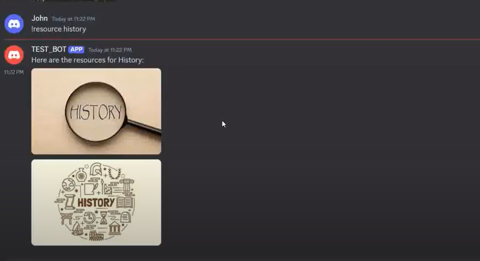

# TIME-TABLE-BOT

[]([https://www.youtube.com/watch?v=YOUR_VIDEO_ID](https://drive.google.com/file/d/1X7pxp5Pk3tB7bcODzl5ufkhn3J2FIpKm/view))


## 🤖 About the Project

This Discord chatbot is designed to help students and educators manage their class schedules, store notes, and access relevant study materials seamlessly through a Discord server. The bot functions as a digital assistant within the server, allowing users to interact with it through simple text commands.

## ✨ Features

- **Schedule Management:** Teachers can add, view, and manage lecture schedules directly from Discord. Students can easily check their schedule for any day of the week.
- **Resource Management:** Teachers can upload subject notes or resource files. Students can easily retrieve these files by requesting them with a simple command.
- **AI-Powered Responses:** The bot uses OpenAI's GPT model to understand and respond to user questions, providing informative and context-aware answers.

## 🛠️ Installation

To get the bot up and running on your Discord server, follow these steps:

1. **Clone the repository:**
    ```bash
    git clone https://github.com/johnmisquitta/TIME-TABLE-BOT.git
    cd discord-ai-bot
    ```

2. **Install dependencies:**
    ```bash
    pip install -r requirements.txt
    ```

3. **Set up your environment variables:**
   - Create a `.env` file in the root directory of your project.
   - Add your Discord bot token and OpenAI API key:
     ```env
     DISCORD_TOKEN=your-discord-bot-token
     OPENAI_API_KEY=your-openai-api-key
     ```

4. **Run the bot:**
    ```bash
    python bot.py
    ```

5. **Invite the bot to your server:**
   - Use the OAuth2 URL generator on the [Discord Developer Portal](https://discord.com/developers/applications) to generate an invite link for your bot.
   - Invite the bot to your desired server.

## 🚀 Usage

Once the bot is running on your server, users can interact with it using specific commands. Below are some examples:

### AI-Powered Responses

- **Ask a Question:**
  ```bash
  !ask How do black holes work?

- **Check Schedule:**
  ```bash
  !schedule

- **Find Resources:**
  ```bash
  !resource <subject_name>

- **Add Schedule:**
  ```bash
  !addschedule <day-date> <schedule>

- **Add Resources:**
  ```bash
  !resource <subject_name> <timings>
  

